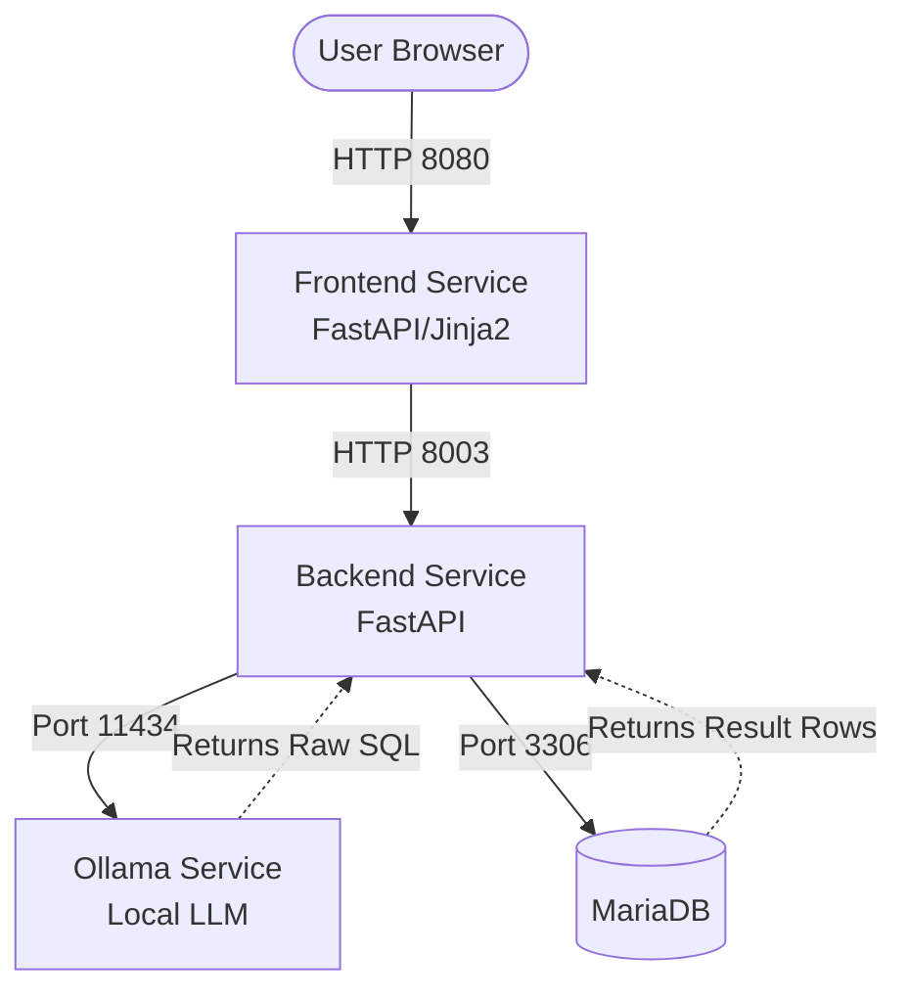

# Natural to SQL 🗄️⚡

> **Turn natural language questions into executable MariaDB queries using a local LLM.**
>
[](https://github.com/AeSoul0/NT-To-SQL/actions/workflows/ci.yml)


## Overview

**Natural to SQL** is a lightweight, full-stack microservices application that translates human language into valid SQL queries. It bridges the gap between non-technical users and relational databases by utilizing a locally hosted Large Language Model (LLM) to infer and execute SQL statements based strictly on the target database schema and live sample data.

## Features

- 🧠 **Natural Language to SQL**: Translates user questions into SQL using a local Ollama instance (tuned for `gemma3:1b-it-qat`).
- 🛠️ **Data Management**: Insert new records directly from the UI or execute raw SQL queries bypassing the LLM.
- 📊 **Schema Explorer**: Dynamically view available tables and columns in the database.
- 🎨 **Modern Developer UI**: A clean, responsive, dark-mode frontend built with FastAPI, Jinja2, and Vanilla JS.
- 🐳 **Fully Dockerized**: Simple, one-click deployment using Docker Compose.
- 🧪 **Automated Testing**: Integrated `pytest` suite for backend validation.

## How It Works

The system operates on a highly optimized, context-aware translation pipeline:  
`Natural Language Request → Schema Injection → Local LLM Processing → SQL Execution → Results Presentation`

1. The FastAPI backend retrieves the live MariaDB schema along with sample data rows.
2. The schema and the user's question are injected into an optimized "Few-Shot" prompt template (acting as semantic building blocks).
3. The local Ollama LLM translates the context into raw SQL syntax.
4. The backend executes the generated SQL against MariaDB and passes the structured payload back to the frontend.

## Example

**Natural Language Input:**
> *"show all Nolan movies and give me the exact count"*

**Generated SQL Output:**
```sql
SELECT m.titolo, m.anno, d.name AS director, COUNT(m.id) OVER() AS total_movies 
FROM movies m 
JOIN directors d ON m.director_id = d.id 
WHERE d.name LIKE '%Nolan%';
```

## Project Structure

The repository is organized into distinct domain boundaries and microservices:

```text
📦 nt-to-sql
 ┣ 📂 backend                 # Python backend service
 ┃ ┣ 📂 src
 ┃ ┃ ┣ 📂 ai                  # LLM integration & prompt templates
 ┃ ┃ ┣ 📂 core                # Environment configs & settings
 ┃ ┃ ┣ 📂 db                  # MariaDB connection handlers
 ┃ ┃ ┣ 📂 schemas             # Pydantic models for request/response
 ┃ ┃ ┗ 📜 main.py             # FastAPI entry point
 ┃ ┣ 📜 Dockerfile            # Multi-stage backend build
 ┃ ┗ 📜 pyproject.toml        # Poetry dependencies
 ┣ 📂 frontend                # Web UI service
 ┃ ┣ 📂 src
 ┃ ┃ ┣ 📂 static              # CSS and Vanilla JS logic
 ┃ ┃ ┣ 📂 templates           # Jinja2 HTML views (index.html)
 ┃ ┃ ┗ 📜 main.py             # FastAPI frontend adapter
 ┃ ┣ 📜 Dockerfile            
 ┃ ┗ 📜 pyproject.toml        
 ┣ 📂 mariadb                 # Database initialization
 ┃ ┗ 📂 mariadb_init          # SQL setup scripts (.sql)
 ┣ 📂 ollama                  # LLM Engine
 ┃ ┗ 📜 Dockerfile            # Custom Ollama pull & build logic
 ┗ 📜 docker-compose.yaml     # Microservices orchestration
```

## Installation

Ensure you have [Docker](https://docs.docker.com/get-docker/) and [Docker Compose](https://docs.docker.com/compose/install/) installed on your machine.

```bash
# Clone the repository
git clone https://github.com/AeSoul0/NT-To-SQL.git
cd nt-to-sql

# Build and start all microservices in detached mode
docker-compose up --build -d
```

*Note: The initial build will download the MariaDB image, build the Python environments, and set up the local Ollama container.*

## Usage

Once the containers are running, access the web interface at:  
👉 **`http://localhost:8080`**

From the interface, you can:
- Use the **Search** tab to type questions in natural language.
- Use the **SQL Query** tab to test manual `SELECT` statements.
- Use the **Insert Data** tab to add new records to the database.
- Use the **Schema** tab to inspect the current database structure.

## Configuration

Environment variables are managed within the `docker-compose.yaml` file. Key configurations include:

- `MARIADB_ROOT_PASSWORD`
- `MARIADB_DATABASE`
- `MARIADB_USER`
- `MARIADB_PASSWORD`
- `OLLAMA_HOST` (Defaults to the internal `ollama` container)

## Architecture

The project is divided into distinct microservices:



## Workflow Example

1. **User Request**: User clicks the shortcut *"Sci-Fi in 2014"*.
2. **SQL Generation**: The backend prompts Ollama with the DB schema, sample rows, and the request.
3. **Execution**: Ollama returns `SELECT ... WHERE m.genere LIKE '%sci-fi%' AND m.anno = 2014`.
4. **Validation & Presentation**: The backend runs the query on MariaDB and the frontend renders the results as an interactive HTML table or raw JSON.

## Limitations

- **Small Model Constraints**: The system currently relies on a lightweight `1B` parameter model. To prevent hallucinations, it heavily utilizes explicit few-shot pattern matching. Complex, novel queries drastically outside the provided prompt examples may fail.
- **Read-Only LLM Pipeline**: The natural language translation is strictly designed for `SELECT` queries. Data insertion relies on explicit REST API endpoints rather than LLM inference for safety.

## Roadmap

- [x] Migrate to a modern, dark-mode developer UI with async form handling.
- [x] Inject live sample data into the LLM prompt for better semantic matching.
- [x] Add "copy to clipboard" functionality for JSON and TSV table results.
- [ ] Implement query sanitization and sandboxing before execution.
- [ ] Support dynamic LLM switching (e.g., swapping to a 7B parameter model) directly from the UI.

## License

© 2026 All Rights Reserved to **[AeSoul0](https://github.com/AeSoul0)**.
